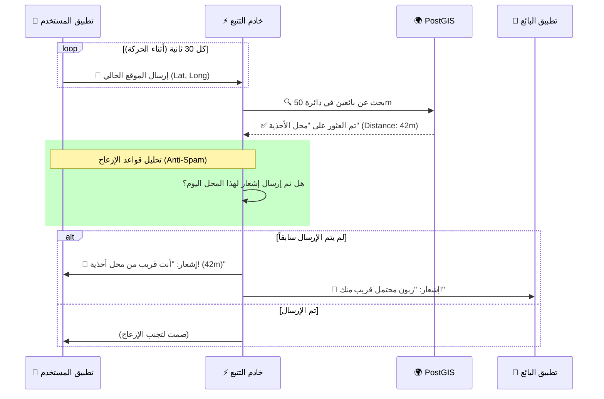

# الخارطة الهندسية للمشروع (System Architecture Map)
**إعداد: المستشار التقني**

هذه الوثيقة تحتوي على المخططات الهندسية البصرية (Visual Diagrams) التي تشرح كيفية ترابط أجزاء النظام.

## 1. المخطط العام للنظام (High-Level Architecture) 🏗️
يوضح هذا المخطط كيف يتفاعل تطبيق الويب والجوال مع الخوادم وقواعد البيانات.

```mermaid
graph TD
    %% Users
    UserMobile[📱 تطبيق الجوال (Native)]
    UserWeb[💻 تطبيق الويب (Next.js)]
    VendorWeb[🏪 لوحة تحكم البائع]

    %% Load Balancer / API Gateway
    LB[🌐 API Gateway / Load Balancer]

    %% Backend Services (Modular Monolith)
    subgraph "Backend Core (Node.js/Next.js)"
        AuthServ[🔐 خدمة الهوية (Auth)]
        MapServ[📍 خدمة الخرائط (Geo Engine)]
        MarketServ[🛒 خدمة السوق (Marketplace)]
        RealTimeServ[⚡ مقبس التتبع (Socket.io)]
    end

    %% Database Layer
    subgraph "Data Layer"
        DB_Main[(🗄️ PostgreSQL)]
        DB_Geo[(🌍 PostGIS Extension)]
        Cache[(🚀 Redis Cache)]
    end

    %% External Services
    ExtMaps[🗺️ Mapbox/Google Maps API]
    ExtPayment[💳 Payment Gateway (Stripe/CMI)]
    ExtPush[🔔 Firebase FCM (Notifications)]

    %% Connections
    UserMobile -->|HTTPS/WSS| LB
    UserWeb -->|HTTPS| LB
    VendorWeb -->|HTTPS| LB

    LB --> AuthServ
    LB --> MapServ
    LB --> MarketServ
    LB --> RealTimeServ

    MapServ -->|Query| DB_Geo
    MarketServ -->|Transact| DB_Main
    RealTimeServ -->|Pub/Sub| Cache
    RealTimeServ -->|Push| ExtPush

    MapServ --> ExtMaps
    MarketServ --> ExtPayment
```

## 2. تدفق منطق "تنبيه الـ 50 متر" (Proximity Alert Logic) 🚶‍♂️↔️🏪
هذا المخطط يشرح "الدماغ" خلف الميزة العبقرية لتنبيه القرب.



## 3. دورة حياة "العملة" والربح (Money Flow) 💸
كيف تتحرك الأموال من المشتري إلى المنصة ثم البائع.

```mermaid
graph LR
    Buyer((👤 المشتري))
    Platform[🏛️ المنصة (الوسيط)]
    Seller((🏪 البائع))
    PaymentGW[💳 بوابة الدفع]

    Buyer -- 1. دفع 100 درهم --> PaymentGW
    PaymentGW -- 2. تأكيد الدفع --> Platform
    
    rect rgb(240, 240, 255)
        Platform -- 3. حجز العمولة (10%) --> PlatformWallet[💰 خزينة المنصة]
        Platform -- 4. إيداع الباقي (90%) --> SellerWallet[💼 محفظة البائع المعلقة]
    end

    Seller -- 5. تسليم المنتج --> Buyer
    Buyer -- 6. تأكيد الاستلام --> Platform
    
    Platform -- 7. تحرير الرصيد --> Seller
    Seller -- 8. طلب سحب الأموال --> BankAccount[🏦 حساب البائع البنكي]
```
