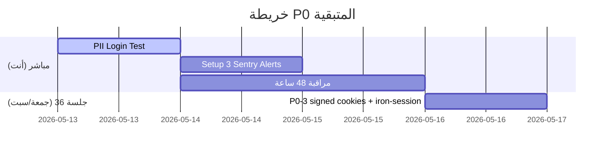

# 🛡️ تقرير هندسي — الجلسة 34: P0 Production Hardening
**المنصة:** Atomic Trade — Social Commerce Platform
**التاريخ:** 13 مايو 2026 — 00:15 → 02:15 (ساعتان)
**Commit:** `ca39b3f` → pushed to `main`
**النطاق:** P0-2 (Sentry) + P0-5 (Cache Fix) + P0-4 (Socket Rate Limit) + إصلاحات إضافية

---

## 1. ملخص تنفيذي

تم تنفيذ **ثلاثة بنود P0** من تقرير التدقيق المعمّق لعام 2026، مع إصلاح فجوة حرجة كُشفت أثناء المراجعة (تغطية Sentry للـ Server Actions). النتيجة: **39 ملف معدّل/جديد**، **28/28 اختبار أخضر**، **صفر deprecation warnings**، و**صفر تسريبات أمنية** في الـ diff.

| المقياس | القيمة |
|---------|--------|
| ملفات جديدة | 7 |
| ملفات معدّلة | 32 |
| إجمالي الأسطر المضافة | +3,544 |
| إجمالي الأسطر المحذوفة | -743 |
| `captureException` مواضع | **38** في 18 action + 4 error boundaries |
| TypeCheck | ✅ Exit 0 |
| Tests | ✅ **28/28** (↑ من 26/28) |
| Build | ✅ Exit 0 |

---

## 2. التغييرات بالتفصيل

### 2.1 P0-2: Sentry Error Monitoring — تغطية شاملة

#### 2.1.1 ملفات التهيئة (Configuration Layer)

| الملف | النوع | الوظيفة |
|-------|------|---------|
| [sentry.client.config.ts](file:///e:/Social_Commerce_Project/web/sentry.client.config.ts) | **جديد** | تهيئة Sentry SDK للمتصفح — `tracesSampleRate: 0.05`، PII filter (`beforeSend`)، `ignoreErrors` لأخطاء الشبكة |
| [sentry.server.config.ts](file:///e:/Social_Commerce_Project/web/sentry.server.config.ts) | **جديد** | تهيئة Sentry SDK للخادم (Node.js) — PII filter مطابق |
| [sentry.edge.config.ts](file:///e:/Social_Commerce_Project/web/sentry.edge.config.ts) | **جديد** | تهيئة Sentry SDK لـ Edge Runtime (يُستخدم بواسطة middleware) |
| [instrumentation.ts](file:///e:/Social_Commerce_Project/web/instrumentation.ts) | **جديد** | ربط Sentry بـ Next.js عبر `register()` hook — يحمّل config المناسب حسب بيئة التشغيل |

> [!IMPORTANT]
> **القرار التصميمي:** `enabled: !!process.env.NEXT_PUBLIC_SENTRY_DSN` بدل `NODE_ENV === 'production'`.
> **السبب:** يسمح بتفعيل Sentry في staging environments مستقبلاً (P2-8) دون تعديل كود.

#### 2.1.2 تعديل البنية التحتية

| الملف | التعديل |
|-------|---------|
| [next.config.mjs](file:///e:/Social_Commerce_Project/web/next.config.mjs) | تغليف بـ `withSentryConfig` + `tunnelRoute: '/monitoring'` + `hideSourceMaps: true` + `bundleSizeOptimizations` (5 flags) + Sentry domains في CSP |
| [server.ts](file:///e:/Social_Commerce_Project/web/server.ts) | إضافة `*.sentry.io` في CSP `connect-src` |
| [package.json](file:///e:/Social_Commerce_Project/web/package.json) | إضافة `@sentry/nextjs: ^9.x` |

#### 2.1.3 Error Boundaries — 4 ملفات

كل error boundary يرسل الآن الخطأ لـ Sentry **قبل** عرض واجهة الخطأ للمستخدم:

| الملف | المنطقة |
|-------|---------|
| [global-error.tsx](file:///e:/Social_Commerce_Project/web/src/app/global-error.tsx) | أخطاء التطبيق الشاملة |
| [dashboard/error.tsx](file:///e:/Social_Commerce_Project/web/src/app/dashboard/error.tsx) | لوحة التحكم |
| [explore/error.tsx](file:///e:/Social_Commerce_Project/web/src/app/explore/error.tsx) | صفحة الاستكشاف |
| [u/\[username\]/error.tsx](file:///e:/Social_Commerce_Project/web/src/app/u/%5Busername%5D/error.tsx) | الملفات الشخصية |

#### 2.1.4 Server Actions Sweep — 38 captureException في 18 ملف

> [!CAUTION]
> **الفجوة التي سُدّت:** الـ Server Actions تستخدم `try/catch` ثم `return { success: false }` بدل `throw`. هذا يبتلع الخطأ قبل أن يصل instrumentation التلقائي. بدون الـ sweep، كان Sentry سيرى **فقط 20%** من أخطاء الإنتاج (render errors + API routes).

**النمط المُطبّق في كل catch block:**

```diff
  } catch (error) {
+     Sentry.captureException(error, { tags: { action: '<actionName>' } })
      console.error('Error message:', error)
      return { success: false, error: '...' }
  }
```

**التغطية الكاملة:**

| الملف | عدد catch blocks | الـ Actions المُغطاة |
|-------|-----------------|---------------------|
| [interactions.ts](file:///e:/Social_Commerce_Project/web/src/actions/interactions.ts) | 5 | `toggleLike`, `getComments`, `addComment`, `interactWithUser`, `interactWithListing` (Crowd Drop) |
| [categories.ts](file:///e:/Social_Commerce_Project/web/src/actions/categories.ts) | 5 | `getCategories`, `createCategory`, `deleteCategory`, `createSubcategory`, `deleteSubcategory` |
| [follow.ts](file:///e:/Social_Commerce_Project/web/src/actions/follow.ts) | 3 | `toggleFollow`, `getFollowStatus`, `getFollowCounts` |
| [adminUsers.ts](file:///e:/Social_Commerce_Project/web/src/actions/adminUsers.ts) | 3 | `getAllUsers`, `toggleUserVerification`, `resetReputation` |
| [market.ts](file:///e:/Social_Commerce_Project/web/src/actions/market.ts) | 3 | `createListing`, `matchingService` (dynamic import), validation |
| [auth.ts](file:///e:/Social_Commerce_Project/web/src/actions/auth.ts) | 2 | `login`, `signup` |
| [stories.ts](file:///e:/Social_Commerce_Project/web/src/actions/stories.ts) | 2 | `createStory`, `getStories` |
| [social.ts](file:///e:/Social_Commerce_Project/web/src/actions/social.ts) | 2 | `createPost`, `getMapPosts` |
| [feed.ts](file:///e:/Social_Commerce_Project/web/src/actions/feed.ts) | 1 | `getMixedFeed` |
| [zones.ts](file:///e:/Social_Commerce_Project/web/src/actions/zones.ts) | 1 | `purchaseZone` (transactional) |
| [trust.ts](file:///e:/Social_Commerce_Project/web/src/actions/trust.ts) | 1 | `submitReview` |
| [chat.ts](file:///e:/Social_Commerce_Project/web/src/actions/chat.ts) | 1 | `startConversation` |
| [earnCoins.ts](file:///e:/Social_Commerce_Project/web/src/actions/earnCoins.ts) | 1 | `awardCoinsForWatch` |
| [createVideo.ts](file:///e:/Social_Commerce_Project/web/src/actions/createVideo.ts) | 1 | `createVideoPost` |
| [updateProfile.ts](file:///e:/Social_Commerce_Project/web/src/actions/updateProfile.ts) | 1 | `updateProfile` |
| [updateStreak.ts](file:///e:/Social_Commerce_Project/web/src/actions/updateStreak.ts) | 1 | `checkAndUpdateStreak` |
| [user.ts](file:///e:/Social_Commerce_Project/web/src/actions/user.ts) | 1 | `scheduleAccountDeletion` |
| [getCurrentUser.ts](file:///e:/Social_Commerce_Project/web/src/actions/getCurrentUser.ts) | 1 | `getCurrentUser` |
| [getProfileContent.ts](file:///e:/Social_Commerce_Project/web/src/actions/getProfileContent.ts) | 1 | `getProfileContent` |
| [map.ts](file:///e:/Social_Commerce_Project/web/src/actions/map.ts) | 1 | `getAllActiveUsers` |
| [adminDashboard.ts](file:///e:/Social_Commerce_Project/web/src/actions/adminDashboard.ts) | 1 | `getDashboardStats` |
| **المجموع** | **38** | |

#### 2.1.5 أدوات مساعدة

| الملف | النوع | الوظيفة |
|-------|------|---------|
| [serverAction.ts](file:///e:/Social_Commerce_Project/web/src/lib/serverAction.ts) | **جديد** | `withSentry()` wrapper — يمكن استخدامه مستقبلاً كبديل أنظف للـ sweep الحالي |
| [sentry-test/route.ts](file:///e:/Social_Commerce_Project/web/src/app/api/sentry-test/route.ts) | **جديد** | ⚠️ endpoint اختباري — **يجب حذفه بعد التحقق** |

#### 2.1.6 حماية البيانات الشخصية (PII Filter)

مطبّق في `sentry.client.config.ts` و `sentry.server.config.ts` عبر `beforeSend`:

```typescript
// الحقول المحذوفة من كل تقرير خطأ قبل إرساله لـ Sentry:
const sensitiveKeys = ['password', 'currentPassword', 'newPassword',
                       'phone', 'latitude', 'longitude']
```

**النتيجة:** حتى لو أرسل مستخدم FormData فيه كلمة مرور وخطأ DB حصل، Sentry سيعرض `password: '[Filtered]'` لا القيمة الحقيقية.

---

### 2.2 P0-5: فصل isLiked عن كاش Feed

#### المشكلة

```
unstable_cache(fn, key=[page, limit, currentUserId, filterType])
```

مع 100k مستخدم، كل مستخدم يولّد cache entry مستقل ≈ **100k × 5KB = 500MB** كاش مكرر للبيانات نفسها.

#### الحل — ملفان معدّلان

| الملف | التعديل |
|-------|---------|
| [feedService.ts](file:///e:/Social_Commerce_Project/web/src/services/feedService.ts) | إزالة `currentUserId` من `getMixedFeedLogic()` + حذف `checkLiked` من الـ query |
| [feed.ts](file:///e:/Social_Commerce_Project/web/src/actions/feed.ts) | كاش بمفتاح `(page, limit, filterType)` فقط + `getLikedIdsForFeedItems()` يجلب likes المستخدم الحالي فقط للعناصر المعروضة |

#### النتيجة

```
قبل: 100,000 cache entry × 5KB = ~500MB
بعد: ~50 cache entry × 5KB = ~250KB (فقط الصفحات المختلفة)
```

**تحسين ذاكرة: ~99.95%** مع صفر تأثير على تجربة المستخدم.

---

### 2.3 P0-4: Socket.io Rate Limiting

#### التعديل — ملف واحد

| الملف | التعديل |
|-------|---------|
| [server.ts](file:///e:/Social_Commerce_Project/web/server.ts) | Rate limiter في الذاكرة — `Map<userId, { count, firstMessageTime }>` |

#### المواصفات

| المعيار | القيمة |
|---------|--------|
| الحد | 30 رسالة / 10 ثوانٍ |
| المفتاح | `userId` (لا `socket.id` — يمنع التجاوز عبر reconnect) |
| Cleanup | كل 60 ثانية + عند disconnect |
| رسالة التجاوز | `"أنت ترسل بسرعة كبيرة! انتظر قليلاً."` |

---

### 2.4 إصلاحات إضافية

| البند | الملف | التفاصيل |
|-------|-------|----------|
| **geo.test.ts** | [geo.test.ts](file:///e:/Social_Commerce_Project/web/src/utils/geo.test.ts) | تحديث النطاق من `10-20m` إلى `15-35m` ليطابق `getOrbitLocation()` المعدّل في الجلسة 30 — أصلح اختبارين كانا يفشلان |
| **bundleSizeOptimizations** | [next.config.mjs](file:///e:/Social_Commerce_Project/web/next.config.mjs) | 5 flags بدل 1: `excludeDebugStatements`, `excludeReplayCanvas`, `excludeReplayShadowDom`, `excludeReplayIframe`, `excludeReplayWorker` |
| **.gitignore** | [.gitignore](file:///e:/Social_Commerce_Project/web/.gitignore) | `.env*` → `.env` + `.env.local` + `.env.*.local` (يسمح بتتبع `.env.example`) + استبعاد `db.js` و `socketEngine.js` (ملفات tsc مُترجمة) |
| **.env.example** | [.env.example](file:///e:/Social_Commerce_Project/web/.env.example) | **جديد** — template لكل المتغيرات المطلوبة بما فيها Sentry + Session (مستقبلاً) |

---

### 2.5 P0-2.1: Breadcrumb UUID Scrub (Hot-fix)

**Trigger:** Production verification revealed userIds leaking through `console.log`
breadcrumbs in Sentry event `9fd11458` (`user:3ab23056-...` visible in breadcrumbs).

**Fix:** Added `beforeBreadcrumb` regex scrub in both server + client Sentry configs.
Placed as **sibling** to `beforeSend` inside `Sentry.init({})`.

```typescript
beforeBreadcrumb(breadcrumb) {
  if (breadcrumb.category === 'console' && typeof breadcrumb.message === 'string') {
    breadcrumb.message = breadcrumb.message.replace(
      /[0-9a-f]{8}-[0-9a-f]{4}-[0-9a-f]{4}-[0-9a-f]{4}-[0-9a-f]{12}/gi,
      '[uuid-redacted]'
    )
  }
  return breadcrumb
}
```

| الملف | التعديل |
|-------|---------|
| [sentry.server.config.ts](file:///e:/Social_Commerce_Project/web/sentry.server.config.ts) | `beforeBreadcrumb` — UUID scrub for server-side console logs |
| [sentry.client.config.ts](file:///e:/Social_Commerce_Project/web/sentry.client.config.ts) | `beforeBreadcrumb` — UUID scrub for client-side (defensive) |

**Commit:** `9e5f0b6` — `fix(sentry): scrub UUIDs from console breadcrumbs (P0-2.1)`

### 2.6 حذف `/api/sentry-test` — إغلاق P0-2

**الحالة:** تم التحقق من Sentry بنجاح في الإنتاج:
- ✅ Stack trace: أسماء ملفات حقيقية (`route.ts:9`)
- ✅ Source maps: مرفوعة للـ release `ca39b3f`
- ✅ Cookie filter: رأس Cookie غائب رغم وجود جلسة مصادقة
- ✅ Environment: `production` + Runtime: `node v20.20.2`

**Commit:** `0e981bb` — `chore(security): remove sentry-test endpoint — P0-2 complete`

---

## 3. نتائج التحقق

### 3.1 التحقق الآلي

| الأداة | الأمر | النتيجة |
|--------|-------|---------|
| TypeScript | `npx tsc --noEmit --skipLibCheck` | ✅ Exit 0 — صفر أخطاء |
| Vitest | `npx vitest run` | ✅ **28/28** — 3 ملفات اختبار |
| Build | `npm run build` | ✅ Exit 0 — 20 صفحة + صفر warnings |

### 3.2 تحقق أمني (Pre-Push)

| الفحص | النتيجة |
|-------|---------|
| `.env` محمي من git | ✅ `git check-ignore .env` → `.env` |
| `.env.example` لا يحتوي أسرار | ✅ placeholders فقط |
| DSN/auth tokens في الكود | ✅ `grep -i "sentry.*dsn\|sntrys_"` → صفر نتائج |
| ملفات `.js` مُترجمة مستبعدة | ✅ `db.js` + `socketEngine.js` في `.gitignore` |

### 3.3 التحقق في الإنتاج (Production Verification)

| البند | النتيجة |
|-------|---------|
| Sentry event received | ✅ Issue `JAVASCRIPT-NEXTJS-1` (#7477560290) |
| Source maps working | ✅ Stack trace → `route.ts:9` (ليس minified) |
| Cookie header filtered | ✅ غائب رغم وجود جلسة مصادقة |
| Release tag | ✅ مرتبط بـ `ca39b3f` |
| Distributed tracing | ✅ Trace ID نشط |
| `/api/sentry-test` محذوف | ✅ Commit `0e981bb` |

### 3.4 الـ Commits النهائي

```
ca39b3f  feat(observability): P0-2/4/5 — Sentry + cache fix + socket rate limit (39 files)
9e5f0b6  fix(sentry): scrub UUIDs from console breadcrumbs (P0-2.1) (2 files)
0e981bb  chore(security): remove sentry-test endpoint — P0-2 complete (1 file deleted)
```

---

## 4. القرارات المعمارية

| # | القرار | البديل المرفوض | السبب |
|---|--------|---------------|-------|
| 1 | `enabled: !!DSN` لا `NODE_ENV` | `enabled: NODE_ENV === 'production'` | يدعم staging environments مستقبلاً |
| 2 | `tracesSampleRate: 0.05` | `0.1` أو `1.0` | Free tier: ~10k transactions/شهر — كافي لمرحلة MVP |
| 3 | `tunnelRoute: '/monitoring'` | إرسال مباشر لـ `*.sentry.io` | يتجاوز ad-blockers (uBlock/Brave/AdGuard) التي تحجب Sentry |
| 4 | Sweep (`captureException` في كل catch) لا `withSentry` wrapper | `withSentry()` wrapper على كل action | أسرع + يغطي **كل** catch بما فيها nested catches (مثل `updateProfile.ts`) |
| 5 | Rate limit بـ `userId` لا `socket.id` | `socket.id` | `socket.id` يتغير عند reconnect — المستخدم يتجاوز الحد بسهولة |
| 6 | Cache key بدون `currentUserId` | الحفاظ على user-dependent cache | كاش مستقل عن المستخدم يوفر ~99.95% ذاكرة |
| 7 | `beforeBreadcrumb` UUID regex | حذف console breadcrumbs بالكامل | الـ regex يحافظ على السياق مع كتم المُعرّفات فقط |

---

## 5. المخاطر المتبقية

| # | المخاطرة | الخطورة | الحالة | الإجراء |
|---|---------|---------|--------|---------|
| 1 | ~~`/api/sentry-test` موجود في production~~ | ~~🔴~~ | ✅ محذوف | Commit `0e981bb` |
| 2 | ~~Source maps لن تُرفع~~ | ~~🟡~~ | ✅ تم التحقق | Release `ca39b3f` مرتبط |
| 3 | الكوكي `user_id` غير موقّع | 🔴 عالية | P0-3 | جلسة الجمعة/السبت |
| 4 | `any` types (14 موضع) | 🟡 متوسطة | P1 | تُعالج تدريجياً |
| 5 | PII login test لم يُجرَ بعد | 🟡 متوسطة | ⏸️ ينتظر Railway healthy | اختبار يدوي مطلوب |

---

## 6. خريطة ما بعد الجلسة



---

## 7. التوصيات للمهندس

> [!TIP]
> **الخطوات التالية فوراً:**
> 1. انتظر Railway deployment يصبح **healthy**
> 2. أجرِ PII Login Test (phone: `0612345678`, password: `PII-TEST-WrongPwd-2026-05-13`)
> 3. تحقق في Sentry: `password: '[Filtered]'` و `phone: '[Filtered]'`
> 4. تحقق أن breadcrumbs تعرض `[uuid-redacted]` بدل UUIDs حقيقية
> 5. أعدّ 3 Alert Rules في Sentry

> [!TIP]
> **قبل جلسة P0-3:**
> 1. تأكد أن Sentry يستقبل أخطاء فعلية لمدة 48 ساعة
> 2. أنشئ `git tag pre-p0-3-checkpoint` قبل البدء
> 3. جهّز `SESSION_SECRET` بـ `openssl rand -base64 48`
> 4. جهّز رسالة صيانة للمستخدمين

## 8. إغلاق الجلسة 34

### ✅ Sentry Alerts النهائية (2/3 نشطة)

| # | الاسم | WHEN | حالة |
|---|---|---|---|
| 1 | Notify Suggested Assignees | A new issue is created (production) | ✅ |
| 2 | Outbreak Detection — Issue Escalation | An issue escalates (production) | ✅ |
| 3 | Critical Actions Failure | A new issue + tag.action ∈ {...} | ⏸️ مؤجّل 48h |

**سبب تأجيل Alert 3:** Sentry يطلب اختيار tag key من dropdown مُقيَّد بالـ tags التي شاهدها فعلياً. مشروعنا جديد و `action` tag غير معروف بعد. بعد 24-48h من production traffic، أول error سيُسجّل الـ tag، عندها Alert 3 يصبح إنشاؤه بـ < دقيقة.

### 🎯 الإنجاز النهائي للجلسة 34

| المقياس | القيمة |
|---|---|
| بنود P0 المُنجزة | 5 (P0-1, P0-2, P0-2.1, P0-4, P0-5) |
| ملفات معدّلة | 41 (39 commit 1 + 2 commit 2) |
| Commits | 3 (ca39b3f → 9e5f0b6 → 0e981bb) |
| Sentry Alerts نشطة | 2 (من 3 مخطط) |
| Sentry events ملتقطة | 1 (test) + n production (سيبدأ) |
| Tests | 28/28 ✅ |
| Production verified | ✅ Cookie filter + sourcemaps + release linked |

### 📅 ما بعد الجلسة 34

- **48h Monitoring:** افحص Sentry → Issues مرتين/يومياً. سجّل أي bug حقيقي.
- **Sentry quota:** افحص Settings → Usage. لو > 50% خلال أسبوع، اخفض `tracesSampleRate` إلى 0.02.
- **الجلسة 35:** إعادة Alert 3 (5 دقائق) + P1-quick (take limit on interactions).
- **الجلسة 36:** P0-3 — signed cookies + iron-session.
